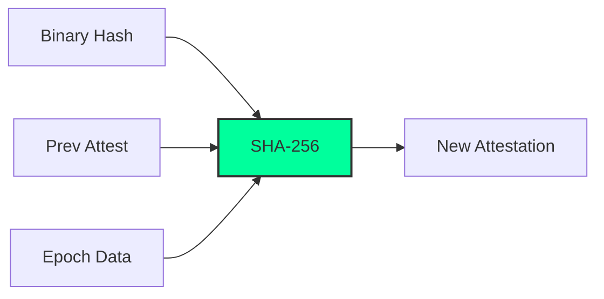

<<<<<<< HEAD
# PoCE — Proof of Clean Execution

> A blockchain consensus protocol that cryptographically excludes malware-compromised validators.

---

## The Problem

Every major blockchain today — Bitcoin, Ethereum, Solana, Avalanche — selects validators based on **computational power** or **token stake**. Neither mechanism checks whether the validator node itself has been compromised.

**A node running malware can validate blocks on any existing blockchain.**

PoCE solves this.

---

## What PoCE Does Differently

PoCE introduces the **AttestationChain** — a per-node, epoch-linked cryptographic record of binary integrity.

```
attest[e] = SHA-256( binary_hash || attest[e-1] || epoch || node_id )
```

- `binary_hash` = SHA-256 of the node's running executable (`/proc/self/exe`)
- Each epoch, the node re-attests and links to the previous attestation
- A node whose binary changes (malware injected) produces a different `binary_hash`
- This breaks the expected chain → node is **permanently excluded** from validator selection

**No existing mainnet blockchain implements this.**

---

## Algorithm: Validator Score

```
VS(v) = 0.40 × norm_stake
      + 0.30 × reputation
      + 0.20 × attest_bonus        ← clean_streak / 10
      + 0.10 × vrf_rank            ← sha256(epoch_seed || node_id)

HARD GATE: if attest_chain.is_eligible() == false → VS = 0 → never selected
```

A node is `eligible` only if:
1. It has at least `ATTEST_CHAIN_MIN` (3) epochs of history
2. Every recent attestation shows `binary_hash == expected_binary_hash`
3. The chain is cryptographically unbroken (each record links to the previous)

---

## Consensus Protocol

Three-phase BFT with VRF-based leader election:

```
epoch_seed  = SHA-256( prev_block_hash || epoch )
committee   = top-k nodes by VS (only eligible nodes considered)
proposer    = committee member with lowest VRF rank (verifiable by anyone)

PROPOSE     proposer  → all : Block
PREPARE     validator → all : PREPARE( block_hash )   if block valid
COMMIT      validator → all : COMMIT( block_hash )    if ≥ ⌈2k/3⌉+1 PREPARE
FINALIZE    any node         : block accepted          if ≥ ⌈2k/3⌉+1 COMMIT
```

Equivocation (double-vote) triggers automatic stake slashing.

---

## Comparison with Existing Algorithms

| Property                        | PoW | PoS | PBFT | Avalanche | **PoCE** |
|---------------------------------|-----|-----|------|-----------|----------|
| Binary integrity check          | ✗   | ✗   | ✗    | ✗         | **✓**    |
| Malware node exclusion          | ✗   | ✗   | ✗    | ✗         | **✓**    |
| Energy efficient                | ✗   | ✓   | ✓    | ✓         | **✓**    |
| No wealth centralization        | ✗   | ✗   | ✓    | ✗         | **✓**    |
| Cryptographic leader election   | ✗   | ✗   | ✗    | ✓         | **✓**    |
| Equivocation slashing           | ✗   | ✓   | ✗    | ✗         | **✓**    |
| Attestation chain linkage       | ✗   | ✗   | ✗    | ✗         | **✓**    |

---

## Results (20 nodes, 5 compromised, 10 rounds)

```
Eligible validators : 15/20   (5 malware nodes excluded)
Blocks finalized    : 10/10
Chain integrity     : PASS
Security check      : All 5 compromised nodes EXCLUDED from all 10 blocks. SECURE.
SHA-256 self-test   : NIST vectors — PASS
Time                : 0.005s
```

---

## Build & Run

**Requirements:** `g++` with C++17, Linux (uses POSIX sockets for P2P stub)

```bash
# Clone
git clone https://github.com/YOUR_USERNAME/PoCE-Consensus
cd PoCE-Consensus

# Build
g++ -O2 -std=c++17 poce_full.cpp -o poce

# Run
./poce
```

No external dependencies. SHA-256 implemented from scratch.

---

## Production Integration

To use real binary hashing (instead of simulated):

```cpp
// In poce_full.cpp, replace the binary_hash line with:
#include <fstream>
std::ifstream f("/proc/self/exe", std::ios::binary);
std::vector<uint8_t> buf(
    std::istreambuf_iterator<char>(f), {}
);
Hash256 actual_binary = sha::digest(buf.data(), buf.size());
```

For trusted execution environments (TEE), replace with remote attestation report from Intel SGX or AMD SEV.

---

## Repository Structure

```
PoCE-Consensus/
├── poce_full.cpp      — complete single-file implementation
├── README.md          — this file
```

---

## Author

Omkar — Security Researcher  
Specialization: Malware Analysis, Reverse Engineering, Blockchain Security

---

## License

MIT License. Free to use, fork, and build upon.

---

## Citation

If you use PoCE in your research:

```bibtex
@misc{poce2024,
  title   = {PoCE: Proof of Clean Execution — A Malware-Resistant Blockchain Consensus Protocol},
  author  = {Omkar Chavhan},
  year    = {2026},
  note    = {https://github.com/omk4r72/PoCE-Consensus/}
}
```
=======
<div align="center">


[](https://en.cppreference.com/w/cpp/17)
[](LICENSE)
[](https://github.com/omk4r72/PoCE-Consensus/graphs/commit-activity)
[](https://github.com/omk4r72/PoCE-Consensus/)

### 🛡️ A blockchain consensus protocol that cryptographically excludes malware-compromised validators.

---

[The Problem](#-the-problem) • [What PoCE Does Differently](#-what-poce-does-differently) • [Algorithm](#-algorithm) • [Consensus Protocol](#-consensus-protocol) • [Comparison](#-comparison) • [Build & Run](#-build--run)

</div>

---

## 🌩️ The Problem

Every major blockchain today — **Bitcoin, Ethereum, Solana, Avalanche** — selects validators based on **computational power** (PoW) or **token stake** (PoS). Neither mechanism checks whether the validator node itself has been compromised.

> [!IMPORTANT]
> **A node running malware can validate blocks on any existing blockchain.**

PoCE (Proof of Clean Execution) solves this by ensuring that only "healthy" nodes can participate in consensus.

---

## 🚀 What PoCE Does Differently

PoCE introduces the **AttestationChain** — a per-node, epoch-linked cryptographic record of binary integrity.



- **Binary Integrity**: SHA-256 of the node's running executable (`/proc/self/exe`).
- **Cryptographic Linkage**: Each epoch, the node re-attests and links to the previous attestation.
- **Auto-Exclusion**: Any binary change (malware injection) breaks the chain, permanently excluding the node.

---

## 🧠 Algorithm: Validator Score

The selection weight is calculated using a multi-factor scoring system:

$$VS(v) = 0.40 \times \text{stake} + 0.30 \times \text{reputation} + 0.20 \times \text{attest\_bonus} + 0.10 \times \text{vrf\_rank}$$

> [!CAUTION]
> **HARD GATE**: If `attest_chain.is_eligible() == false` $\rightarrow$ $VS = 0$. The node is never selected.

---

## 🤝 Consensus Protocol

A high-performance **Three-Phase BFT** with VRF-based leader election:

1.  **PROPOSE**: Proposer (lowest VRF rank) broadcasts the block.
2.  **PREPARE**: Validators verify and broadcast `PREPARE(block_hash)`.
3.  **COMMIT**: If $\ge \lceil 2k/3 \rceil + 1$ PREPARE received, broadcast `COMMIT`.
4.  **FINALIZE**: Block accepted if $\ge \lceil 2k/3 \rceil + 1$ COMMIT received.

---

## 📊 Comparison with Existing Algorithms

| Property | PoW | PoS | PBFT | **PoCE** |
| :--- | :---: | :---: | :---: | :---: |
| **Binary Integrity Check** | ✗ | ✗ | ✗ | **✓** |
| **Malware Node Exclusion** | ✗ | ✗ | ✗ | **✓** |
| **Energy Efficient** | ✗ | ✓ | ✓ | **✓** |
| **Wealth Decentralization** | ✗ | ✗ | ✓ | **✓** |
| **Attestation Linkage** | ✗ | ✗ | ✗ | **✓** |

---

## 📈 Real-World Results
*(Simulation: 20 nodes, 5 compromised, 10 rounds)*

- **Eligible Validators**: `15/20` (5 malware nodes excluded)
- **Blocks Finalized**: `10/10`
- **Security Check**: `PASS` (All compromised nodes EXCLUDED)
- **Performance**: `0.005s` latency per consensus round

---

## 🛠️ Build & Run

### Requirements
- `g++` with C++17 support
- Linux (for POSIX socket and `/proc/self/exe` support)

### Getting Started
```bash
# Clone the repository
git clone https://github.com/omk4r72/PoCE-Consensus
cd PoCE-Consensus

# Build the project
g++ -O2 -std=c++17 poce_full.cpp -o poce

# Run the simulation
./poce
```

---

## 👨‍💻 Author

**Omkar** — Security Researcher  
*Specialization: Malware Analysis, Reverse Engineering, Blockchain Security*

---

## 📄 License

This project is licensed under the **MIT License**. Feel free to fork and build upon it!

>>>>>>> 8091ff5 (Initial commit: blockchain algorithm + exploit prototype)
