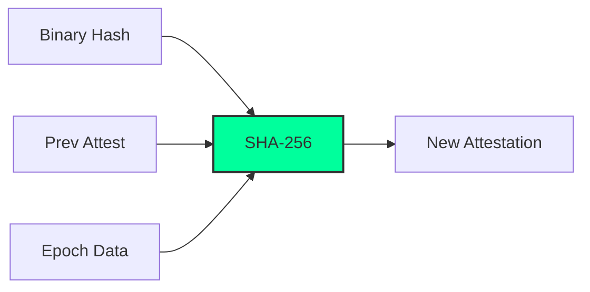

<div align="center">


[](https://en.cppreference.com/w/cpp/17)
[](LICENSE)
[](https://github.com/omk4r72/PoCE-Consensus/graphs/commit-activity)
[](https://github.com/omk4r72/PoCE-Consensus/)

### 🛡️ A blockchain consensus protocol that cryptographically excludes malware-compromised validators.

---

[The Problem](#-the-problem) • [What PoCE Does Differently](#-what-poce-does-differently) • [Algorithm](#-algorithm) • [Consensus Protocol](#-consensus-protocol) • [Comparison](#-comparison) • [Build & Run](#-build--run)

</div>

---

## 🌩️ The Problem

Every major blockchain today — **Bitcoin, Ethereum, Solana, Avalanche** — selects validators based on **computational power** (PoW) or **token stake** (PoS). Neither mechanism checks whether the validator node itself has been compromised.

> [!IMPORTANT]
> **A node running malware can validate blocks on any existing blockchain.**

PoCE (Proof of Clean Execution) solves this by ensuring that only "healthy" nodes can participate in consensus.

---

## 🚀 What PoCE Does Differently

PoCE introduces the **AttestationChain** — a per-node, epoch-linked cryptographic record of binary integrity.



- **Binary Integrity**: SHA-256 of the node's running executable (`/proc/self/exe`).
- **Cryptographic Linkage**: Each epoch, the node re-attests and links to the previous attestation.
- **Auto-Exclusion**: Any binary change (malware injection) breaks the chain, permanently excluding the node.

---

## 🧠 Algorithm: Validator Score

The selection weight is calculated using a multi-factor scoring system:

$$VS(v) = 0.40 \times \text{stake} + 0.30 \times \text{reputation} + 0.20 \times \text{attest\_bonus} + 0.10 \times \text{vrf\_rank}$$

> [!CAUTION]
> **HARD GATE**: If `attest_chain.is_eligible() == false` $\rightarrow$ $VS = 0$. The node is never selected.

---

## 🤝 Consensus Protocol

A high-performance **Three-Phase BFT** with VRF-based leader election:

1.  **PROPOSE**: Proposer (lowest VRF rank) broadcasts the block.
2.  **PREPARE**: Validators verify and broadcast `PREPARE(block_hash)`.
3.  **COMMIT**: If $\ge \lceil 2k/3 \rceil + 1$ PREPARE received, broadcast `COMMIT`.
4.  **FINALIZE**: Block accepted if $\ge \lceil 2k/3 \rceil + 1$ COMMIT received.

---

## 📊 Comparison with Existing Algorithms

| Property | PoW | PoS | PBFT | **PoCE** |
| :--- | :---: | :---: | :---: | :---: |
| **Binary Integrity Check** | ✗ | ✗ | ✗ | **✓** |
| **Malware Node Exclusion** | ✗ | ✗ | ✗ | **✓** |
| **Energy Efficient** | ✗ | ✓ | ✓ | **✓** |
| **Wealth Decentralization** | ✗ | ✗ | ✓ | **✓** |
| **Attestation Linkage** | ✗ | ✗ | ✗ | **✓** |

---

## 📈 Real-World Results
*(Simulation: 20 nodes, 5 compromised, 10 rounds)*

- **Eligible Validators**: `15/20` (5 malware nodes excluded)
- **Blocks Finalized**: `10/10`
- **Security Check**: `PASS` (All compromised nodes EXCLUDED)
- **Performance**: `0.005s` latency per consensus round

---

## 🛠️ Build & Run

### Requirements
- `g++` with C++17 support
- Linux (for POSIX socket and `/proc/self/exe` support)

### Getting Started
```bash
# Clone the repository
git clone https://github.com/omk4r72/PoCE-Consensus
cd PoCE-Consensus

# Build the project
g++ -O2 -std=c++17 poce_full.cpp -o poce

# Run the simulation
./poce
```

---

## 👨‍💻 Author

**Omkar Chavhan (omk4r72)** — Security Researcher  
*Specialization: Malware Analysis, Reverse Engineering, Blockchain Security*

---
